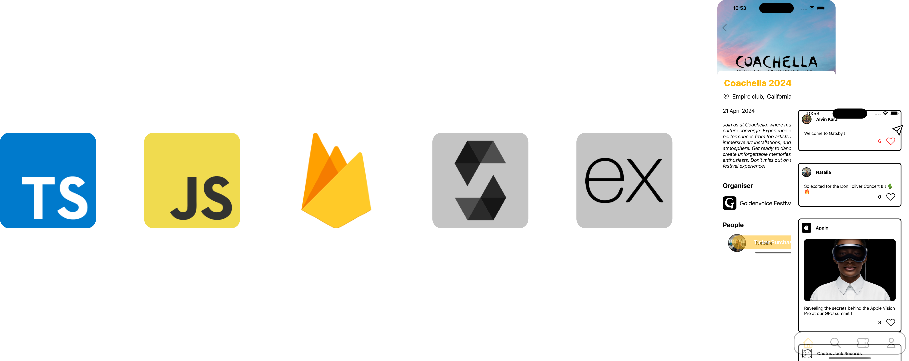
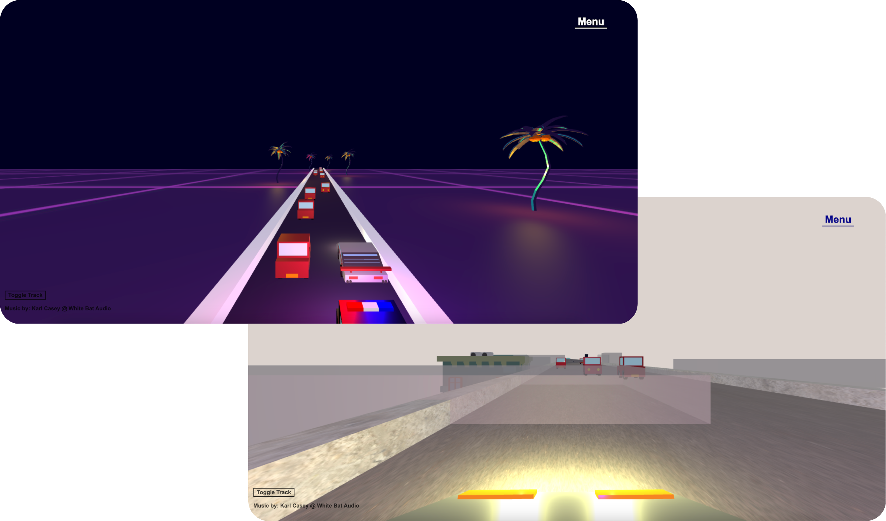

<!-- Stylesheet -->
<link rel='stylesheet' href='./styles/styles.css'/>

<!-- Header -->

    <!-- Profile -->
    
    <!-- Name and tags -->
    

        <!-- Name -->
        <h1>
            Hey there, I'm Alvin 👋🏾
        </h1>
        <!-- Tags -->
        

            Fullstack Developer | RAG and LLM Developer
        

        <!-- Description -->
        

            I am passionate about turning ideas into reality by leveraging a diverse set of frameworks. My interests span web and mobile development, blockchain, machine learning, and artificial intelligence, allowing me to explore innovative solutions across various domains.
        

    

<h1>Tech Stack </h1>

<!-- SPACING -->

<!-- Technical Tools -->

    <!---->
    
    <!---->
    
    <!---->
    
    <!---->
    
    <!---->
    
    <!---->
    
    <!---->
    
    <!---->
    
    <!---->
    
    <!---->
                       

<!-- SPACING -->

<!-- Projects -->
<h1>Projects</h1>

<!-- SPACING -->

<!-- Gatsby -->

    <!-- Details -->
    

        <h2><a href='https://github.com/karaalv/Gatsby-Public'>Gatsby</a></h2>
        

            Ticket distribution mobile platform that leverages Web3 technology to authenticate and secure tickets. The app transforms event tickets into non-fungible digital assets secured by the <strong>Ethereum blockchain</strong> and stored on the <strong>IPFS network</strong>. Furthermore, <strong>social media</strong> dynamics are integrated into the platform to enrich user engagement with events.
        

        <!-- Tech stack -->
        

            <!---->
            
            <!---->
            
            <!---->
            
            <!---->
            
            <!---->
            

                
            

        

    

    <!-- Image -->
    

<!-- Getaway -->

    <!-- Details -->
    

        <h2><a href='https://github.com/karaalv/Getaway'>Getaway</a></h2>
        

            Developed using <strong>three.js</strong>, this game lets players control a sports car to navigate a course whilst avoiding oncoming vehicles. Inspired by classic arcade games like Out Run and Neon Drive, Getaway features voxel art designed in <strong>Blender</strong> to evoke an 80s arcade aesthetic.
        

        <!-- Tech stack -->
        

            <!---->
            
            <!---->
            
            <!---->
            
            <!---->
            
            <!---->
            
        

    

    <!-- Image -->
    

<!-- SPACING -->

<!-- Additional details drawer -->

    
&nbsp;&nbsp;<i>More About Me</i> 📍

    <ul>
        <li style='margin: 1%'>Pursuing MSc in <strong>Business Analytics</strong> at <strong>Imperial College London</strong></li>
        <li style='margin: 1%'>BEng in <strong>Computer Systems Engineering</strong> from the <strong>University of Warwick</strong></li>
        <li style='margin: 1%'>Previously <strong>Co-Chief Electrical Systems Engineer</strong> at Warwick Racing <strong>Formula Student</strong></li>
    </ul>

