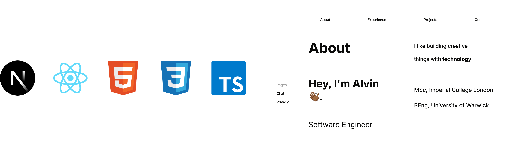

<!-- Header -->

    <!-- Description -->
    

        I like taking on complex problems and implementing creative 
        solutions; from statistical modelling and building systems to designing dynamic user experiences.
          
        I aim to work on meaningful projects that challenge me intellectually and push me to grow technically 
        and creatively.
    

<!-- Portfolio -->

    <!-- Details -->
    <h3>Portfolio Website</h3>
    

        

            I built a website to showcase my projects and experience.
            It also features:
        

        <ul>
            <li>A chat agent that impersonates me using a custom RAG system to give contextually aware answers.</li>
            <li>A résumé and cover letter generator that tailors applications directly from job descriptions or URLs.</li>
        </ul>
        

            Feel free to explore here:
        <a href='https://alvinkaranja.dev'>alvinkaranja.dev</a>
        

    

    <!-- Image -->
    

        
    

<!-- Technical Skills -->
<h2>Technical Skills</h2>

    <!-- Languages -->
    
    
    
    
    
    
    
    
    <!-- Databases -->
    
    
    
    
    <!-- ML -->
    
    
    
    
    
    
    <!-- Web dev -->
    
    
    
    
    
    <!-- Cloud and dev Ops -->
    
    
    
    
    
    

 